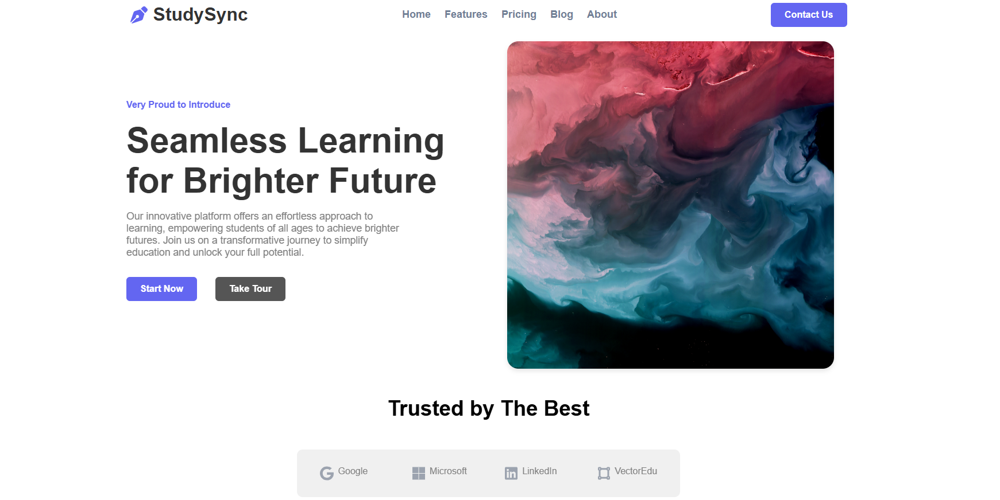
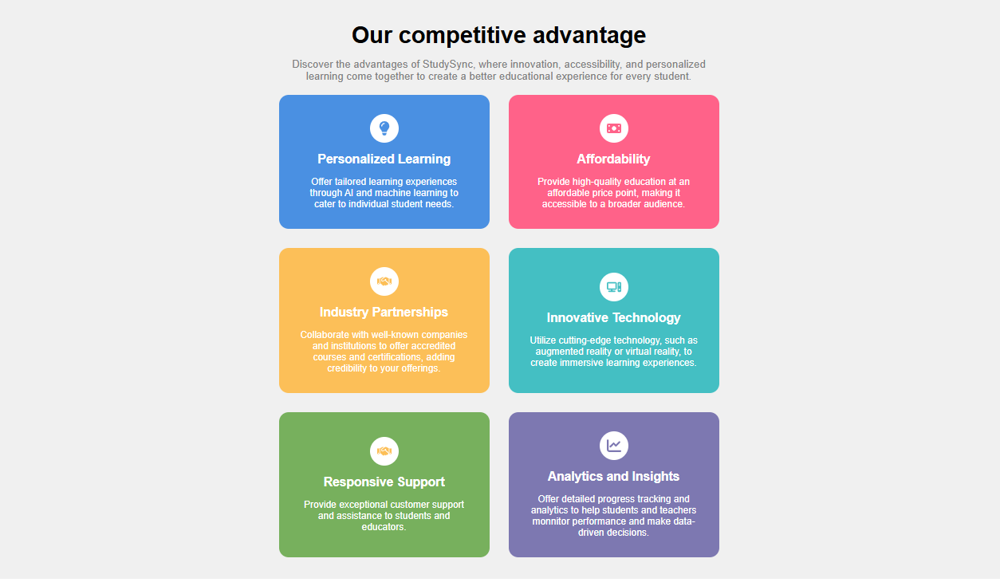

# StudySync

StudySync is a modern, responsive, and visually appealing educational landing page built using HTML5 and CSS3. The website showcases a clean user interface with sections for features, company partners, testimonials, newsletter subscription, and more.

## Live Demo

https://webdel-ie.github.io/StudySync/

## Preview

### Homepage

### Features

## Technologies Used

- HTML5
- CSS3
- Flexbox
- CSS Grid
- Media Queries

## Characterstics

- Responsive Design
- Hero Section
- Company Showcase
- Feature Cards
- Testimonials
- Newsletter Section
- Footer Navigation
- Mobile Friendly

## Project Structure

StudySync/

- index.html
- style.css
- images/
- README.md

## Author

Nishita Rawat

GitHub: https://github.com/Webdel-ie